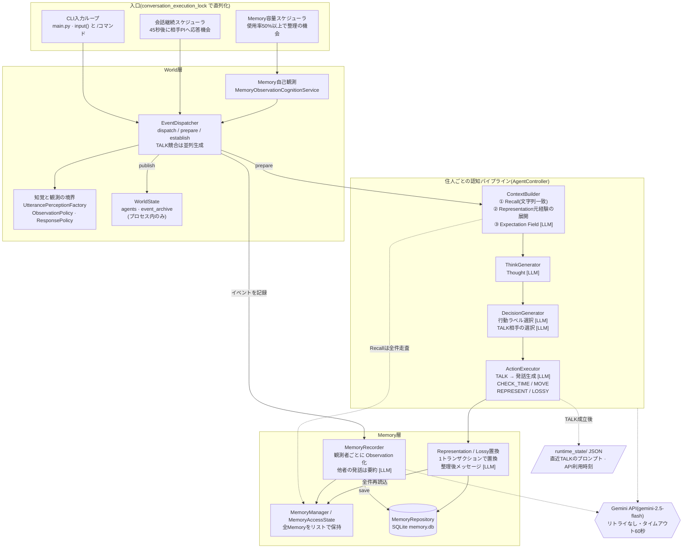

# Living Agent 構造レビュー

- 対象: `living_agent` ブランチ `claude/modest-hopper-pjj8qg`、コミット `83e129e`(2026-09-15)
- 確認日: 2026-09-25
- 同じ内容のHTML版: [structure_review.html](./structure_review.html)(ダウンロードしてブラウザで開くと図が見やすい)

ステラとシリカの2人の住人(PI)が、ユーザーとの会話・住人同士の会話・自分のMemoryの観測を通じて経験を積むCLIアプリ。世界で起きた事実と、住人それぞれが主観的に受け取った観測をはっきり分ける設計が軸になっている。

| 項目 | 値 |
| --- | --- |
| リポジトリ内の `.py` ファイル | 473(約5.2万行) |
| `main.py` から実際に import されるモジュール | 57 |
| ルート直下のテスト | 264件成功 / 14件失敗 |
| ユーザー発話1回あたり、住人1人が呼ぶGemini API | 約5〜6回 |

## アーキテクチャ図

実行時の構造(`main.py` から到達できる57モジュールが対象。実験用コードは含まない)。入口が3つあり、どれも `conversation_execution_lock` で1ターンずつ直列化されてから World層に入る。`[LLM]` は Gemini API を呼ぶ箇所。

## ユーザー発話1回の流れ

「ステラ、今どうしてる?」と入力したとき。宛先が指定されていても、ステラが「集中している」状態でない限り、シリカにも発話は聞こえている。

1. `main.py` が発話中の名前から宛先を決め、`UtteranceEvent(speaker=user)` を作ってロック内で `dispatcher.dispatch()` を呼ぶ。
2. Dispatcher がイベントを WorldState に publish。住人ごとに `ObservationPolicy`(同じ場所か)→ `UtterancePerceptionFactory`(集中中なら名前以降だけ聞こえる)→ `ResponsePolicy`(応答機会があるか)を順に判定。
3. 応答する住人ごとに `ContextBuilder` が Recall(Memory全件への文字列一致スコア)→ Representation元経験の展開 → Expectation Field 生成 **[LLM]**。
4. `GeminiThinkGenerator` が Thought を生成 **[LLM]**。
5. `RuleBasedDecisionGenerator` が「キッチンへ行って」「少し待って」だけは規則で処理し、それ以外は TALK / WAIT / CHECK_TIME から1つ選ばせる **[LLM]**。TALKなら発言相手も選ばせる **[LLM]**。
6. TALKの住人が複数いれば並列に発話を生成 **[LLM]** し、先に生成が終わった1人の発話だけを World に成立させる。
7. `MemoryRecorder` がターン内の全イベントを観測者ごとに Memory 化し、SQLite に保存。他者の発話は要約してから保存 **[LLM]**。
8. 成立したTALKのプロンプトを `runtime_state/*_last_talk.json` に保存し、CLIに表示。45秒後に相手PIへ応答機会を渡す継続をスケジュール。

## 3つの入口

- **CLI入力**: 通常の発話のほかに `/pass`(直前の住人発言を相手に渡す)、`/observe-memory`(Memoryを見る機会)、`/status`、`/memory`、`/debug`。
- **会話継続**: 住人が発言したら、聞いていた相手に45秒後に応答機会を渡す。WAITを選ぶと相手に「返答が届かなかった」という観測が渡る。CHECK_TIMEの後は待ち時間なしで続く。
- **Memory容量**: 上限5000件に対する使用率で間隔が変わる(50%で60分、90%で15分)。95%を超えると、90%を下回るまで Lossy置換だけを選ばせるループに入る。

## 良いところ

- **世界の事実と主観の分離が一貫している。** WorldEvent は事実、Observation は観測者ごとの記述で、誰が何を見られるかは `ObservationPolicy` の1か所に集まっている。Thought や Decision が本人にしか見えない点も明確。
- **知覚のモデルが丁寧。** 集中中は自分の名前が出たところから後だけ聞こえる、PIが選んだ発言相手は周囲に開示しない、など「聞こえ方」を `UtterancePerception` として独立させている。
- **ユーザー入力との競合処理がよく考えられている。** 継続処理は Thought/Decision の生成と World への成立を分け、世代番号で失効を検出している。副作用のある MOVE だけ先に確定する区別もある。
- **Lossy置換がアトミック。** Representation 関係の一部だけを消すことを禁止し、1トランザクションで挿入・削除してから、DBを正として実行時の状態を読み直している。
- **プロンプトが誘導しないように書かれている。** 「どれかを優先する必要はありません」「確率、重要度、感情は生成しない」など、LLM に答えを寄せない書き方で統一されている。

## 指摘事項

重要度: 高=動作が止まる・意図しない挙動が続く、中=性能や設計上のリスク、低=整理すると読みやすくなる。

### 【高】通常の発話でGemini APIが失敗すると、CLI全体が落ちる

`main.py:722-737` · `event_dispatcher.py:79`

- **起きること**: `/pass` と `/observe-memory` は try/except で囲まれているが、通常の発話経路の `dispatcher.dispatch(event)` は囲まれていない。TALK本文の生成失敗だけは Dispatcher 内で握りつぶされるが、Expectation Field・Thought・Decision・記憶要約(JSON解析失敗を含む)で例外が出ると、そのままメインループを抜けてプロセスが終了する。
- **影響**: 一時的なAPIエラー1回でセッションが終わる。ユーザー発話は WorldState には publish 済みなのに Memory には一部しか保存されない、という中途半端な状態も起こりうる。
- **提案**: 他のコマンドと同じく try/except で囲み、エラーを表示して入力に戻す。あわせて `GeminiTextGenerator` に短いリトライ(429や5xxに対して2〜3回)を入れる。

### 【高】お互いにWAITを選び続けると、NoReplyの往復が止まらない

`conversation_continuation.py:86-108`

- **起きること**: AがWAITを選ぶとBに NoReplyEvent が渡り、BもWAITを選ぶと今度はAに NoReplyEvent が渡る。この往復に終了条件がないため、アプリを起動している限り45秒ごとに続く。
- **影響**: 1往復ごとに Gemini 呼び出しが約3回(Expectation Field・Thought・Decision)、Memory が3件(NoReply・Thought・Decision)増える。1時間放置すると約240回の呼び出しと約240件の Memory になり、容量上限5000件の半分に約10時間で達する計算。
- **提案**: 「生きている」表現として意図的なら、連続WAIT回数による打ち切りか、間隔を倍々に伸ばす仕組みを入れる。意図していないなら、NoReplyに対するWAITでは継続を作らない。CHECK_TIME の後は待ち時間0秒で継続するので、CHECK_TIME を繰り返し選んだ場合も同様に高速なループになりうる。

### 【高】LLMなしの構成では住人が一切発言しなくなっている

`context_builder.py:91` · `rule_based_decision_generator.py:27, 42`

- **起きること**: `ContextBuilder` が常に `available_action_types=(TALK, WAIT, CHECK_TIME)` を設定するようになったため、`RuleBasedDecisionGenerator` は必ず `_choose_available_action` に進む。text_generator がないとそこで必ず WAIT を返すので、`integration_test_runner.py`(LLMを使わない動作確認)では住人が発言しない。`test_integration_test_runner` と `test_living_loop` の失敗はこれが原因。
- **もう一つの変化**: 同じ理由で `_choose_talk_or_wait` は通常経路から到達できなくなった。以前はこの判断プロンプトに「思い出した経験」と「経験全体から感じられる傾向」が入っていたが、現在の行動選択プロンプトには入っていない。意図した変更かどうか確認したい。
- **提案**: text_generator がないときは TALK を既定にする(以前の挙動)。行動選択プロンプトに想起とExpectation Fieldを戻すかどうかは、設計として判断する。

### 【中】Recallの計算量が大きく、Memoryが増えると応答が遅くなる

`memory_recall_service.py:93-150`

- **起きること**: `_common_text_score` は入力文のすべての部分文字列(長さ3以上)について、Memory 1件ずつ `in` 検索する。入力長をL、Memory件数をNとすると、おおよそ L²×N 回の文字列検索。
- **実測**: Memory 5000件、入力80文字で1回の Recall に **4.4秒**。応答する住人ごとに実行され、しかもロックを持ったまま走るため、その間はユーザー入力も待たされる。住人同士の長い発話が入力になると、さらに伸びる。
- **提案**: Memory ごとに文字3-gramの集合を事前計算して共通 n-gram 数でスコアを近似する、入力長に上限を設ける、recall_keys による絞り込みを先に行う、など。

### 【中】TALKの競合で「生成が先に終わった方」が勝ち、負けた側はそれを知らない

`event_dispatcher.py:291-316`

- **起きること**: 2人ともTALKを選んだ場合、`as_completed` の順で最初に返ってきた発話だけが成立する。勝敗はAPIの応答速度で決まる。負けた側の Thought と「発言する」という Decision は Memory に残るが、自分の発言が成立しなかったという観測は残らない。
- **提案**: 勝敗の決め方(宛先を優先する、交互にするなど)を明示的なルールにする。負けた側には「話そうとしたが相手が先に話した」ことが観測として残るようにするか、少なくとも Decision を記録しないようにする。

### 【中】容量整理のループがロックを持ったまま長時間走ることがある

`memory_capacity_scheduler.py:121-219`

- **起きること**: `_fire_inner` は実行ロックを取ったまま、期限が来た住人を順番に処理する。1人あたり Thought・Decision・置換文・整理後メッセージなど複数回のLLM呼び出しがあるため、その間にユーザーが入力しても何も表示されずに待たされる。
- **提案**: 1回の発火では1人だけ処理して次のタイマーに回す。処理中であることを CLI に一行出す。

### 【中】Lossy置換後のMemoryや自分の発話は、検索型Recallに一度も出てこない

`memory_recall_service.py:43` · `memory_recorder.py:83`

- **起きること**: Recall は `recall_text` を持つ Memory だけを対象にするが、recall_text が作られるのは他者の発話だけ。自分の発言・Thought・Lossy置換で残した Memory は、直近10件に入っている間しか思い出せない。
- **確認したいこと**: 「自分で整理して残したMemoryほど思い出せない」という結果になっているので、設計として意図したものかを確認したい。意図していないなら、Lossy置換時に `MemorySummarizer.summarize_as_single_memory` で recall metadata を付けられる(Representation 用に作られたもので、現在は main.py からは使われていない `memory_representation_metadata_service.py` が呼んでいる)。

### 【低】細かい不整合

- TALKの相手に OTHER を選ぶと `recipient_id="other"` という文字列のまま保存される(`rule_based_decision_generator.py:122`)。住人が2人のうちは困らないが、3人以上になると意味が曖昧になる。
- 返答プロンプトの【現在の出来事】は `user -> stella: …` のように内部IDで表示される一方、Memory は「ユーザーが…」と表示名で書かれている(`prompt_builder.py:159`)。
- 行動ラベルが想定外のときは黙って WAIT になるが、発言相手のラベルが想定外のときは例外になる。扱いがそろっていない。
- `last_resident_speaker_id` は更新されるだけで、どこからも読まれていない(`main.py:190, 296-304`)。
- `ApiActivityStore.record_request` は並列TALKの複数スレッドから同じJSONを直接上書きする。他のストアのように一時ファイル経由で置き換えるほうが安全(`api_activity_store.py:20`)。

## テストの状況

requirements.txt も pyproject.toml もないため、pytest と google-genai を入れてから実行した。リポジトリのルートで `pytest` をそのまま実行すると、`20260822/` にある同名モジュールのコピーと衝突して、収集の時点で100件のエラーになる。ルート直下の `test_*.py` だけを指定して実行した結果は次のとおり。

| 原因 | 失敗したテスト | 件数 |
| --- | --- | ---: |
| LLMなしだとWAITしか選ばない(上の指摘) | test_integration_test_runner, test_living_loop | 2 |
| テスト用のダミー生成器に `generate_json` がない | test_memory_expectation_recent_model | 5 |
| テストが `Decision.action_type` に文字列を渡している | test_response_generator | 3 |
| ダミーの ResponsePolicy が `perception` 引数を受け取らない | test_event_dispatcher | 1 |
| 削除された `update_recall_text` を呼んでいる | test_memory_repository | 1 |
| 知覚を通すようになり source_event が同一オブジェクトでなくなった | test_memory_persistence | 1 |
| 想起Memoryのプロンプト表示形式が変わった | test_prompt_builder | 1 |

14件中12件は、本体の変更にテストが追従していないだけ。本当の不具合を示しているのは最初の2件。

## リポジトリの構成

473個の `.py` ファイルがすべてルートに並んでいて、そのうち実行時に使われるのは57モジュール。残りは実験スクリプト(`*_experiment.py`)、スモークテスト、ユニットテスト、そして main.py から使われていない Knowledge 系・Reflection 系・予測系のモジュール。

さらに `20260822/` に本体一式のコピー(210ファイル)、`archive/` に実験ごとのzip(約11MB)が git 管理下にある。どれが現行コードかがファイル一覧から分かりにくく、上のようにテスト収集も壊れる。

`main.py`(741行)は、組み立て・グローバル状態(容量整理セッションなど)・コマンド処理・スケジューラのハンドラを1ファイルに持っていて、テストしにくい形になっている。

## 次にやるとよいこと

1. 通常発話の経路を try/except で囲み、Gemini 呼び出しに短いリトライを入れる(数行で済み、効果が大きい)。
2. WAIT同士の NoReply の往復に止まる条件を入れる。
3. LLMなしのときの Decision を TALK に戻し、失敗しているテスト12件を現在のインターフェースに合わせる。`requirements.txt` と、`testpaths` を指定した `pytest.ini` を追加する。
4. 実行時コード・実験・テスト・スナップショットをディレクトリで分ける。たとえば `living_agent/`(world・cognition・memory・llm)、`experiments/`、`tests/` に分け、`20260822/` と `archive/` は git のタグか外部ストレージに移す。
5. Recall をn-gram索引で高速化する。Memory が数千件に近づく前にやっておくと安心。
6. TALK競合の勝敗ルールと、Lossy置換後の Memory を思い出せるようにするかどうかを、設計として決める。
