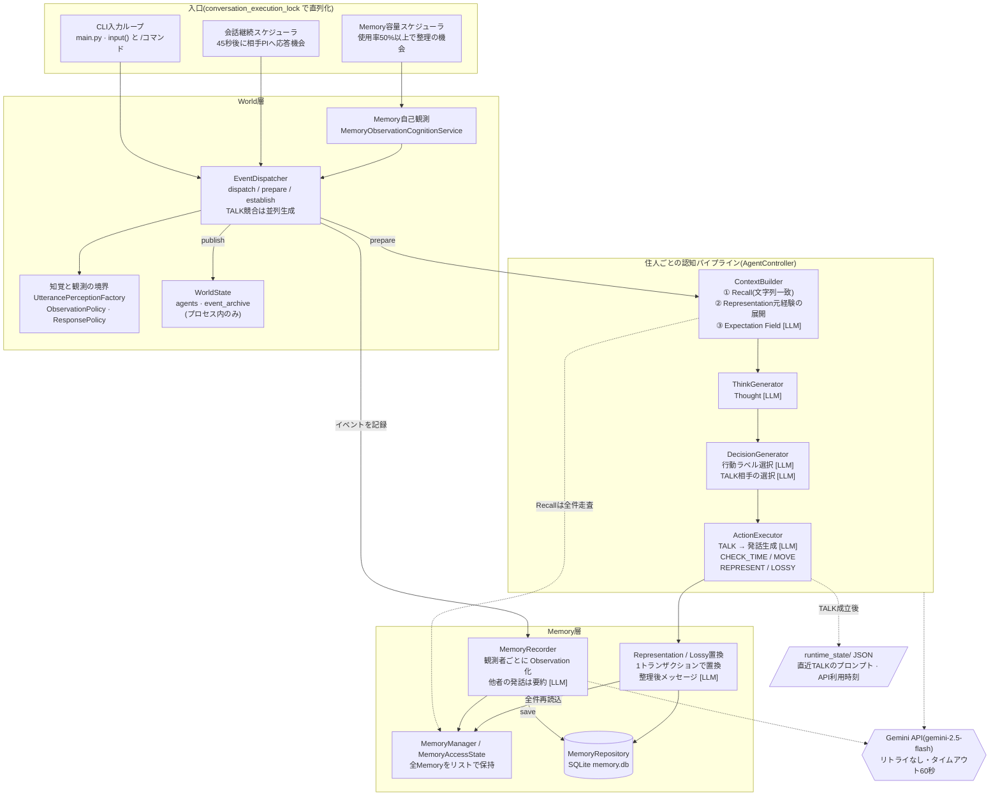

# Living Agent 構造レビュー

- 対象: `living_agent` の `experiments` ブランチ、コミット `5bfd74c`(2026-09-24)
- 初版の対象: ブランチ `claude/modest-hopper-pjj8qg`、コミット `83e129e`(2026-09-15)
- 確認日: 2026-09-25
- 同じ内容のHTML版: [structure_review.html](./structure_review.html)(ダウンロードしてブラウザで開くと図が見やすい)

ステラとシリカの2人の住人(PI)が、外部からの発話・住人同士の会話・自分のMemoryの観測・RSS記事の読書を通じて経験を積むCLIアプリ。世界で起きた事実と、住人それぞれが主観的に受け取った観測をはっきり分ける設計が軸になっている。

| 項目 | 83e129e | 5bfd74c |
| --- | ---: | ---: |
| ルート直下の `.py` ファイル | 264 | 301 |
| `.py` ファイル総数(`20260822/` を含む) | 473 | 510 |
| `main.py` から実際に import されるモジュール | 57 | 74 |
| ルート直下のテスト(成功 / 失敗) | 264 / 14 | 390 / 2 |
| Memory 5000件・入力80文字での Recall 1回 | 4.4秒 | 6.6秒 |

## 5bfd74c での再確認

初版(`83e129e`)からの18コミットを確認し、各指摘が解消したかを見直した。

| 初版の指摘 | 状態 | 5bfd74c で確認したこと |
| --- | --- | --- |
| Gemini APIの失敗でCLI全体が落ちる | 解消 | 外部入力は別スレッドの `process_external_input` で処理され、例外は `[システム]` 表示で止まる(`main.py:798-815`)。429/503/504 は段階ごとに最大3回まで試行(`api_retry.py`)。失敗時は受け取った発話だけを記録し、生成は捨てる方針が明示された(`event_dispatcher.py:101-106`)。 |
| WAIT同士の NoReply の往復が止まらない | 残る | `conversation_continuation.py` は変更なし。 |
| LLMなしの構成では住人が発言しない | 一部解消 | テストはLLMなし専用の `DirectReplyDecisionGenerator` に差し替えて通るようになった。`RuleBasedDecisionGenerator` 自体は、text_generator がないと今も WAIT を返す。行動選択プロンプトに想起とExpectation Fieldが入らない点も変わらない。 |
| Recall の計算量が大きい | 残る(悪化) | 文字列一致の方式は同じ。加えて Memory 1件ごとに `recall_search_text` が他者認知を SQLite から読むようになり、同条件で 4.4秒 → 6.6秒。 |
| TALK競合は生成が先に終わった方が勝つ | 残る | `event_dispatcher.py:287-350` の勝敗の決め方は同じ。 |
| 容量整理がロックを持ったまま長時間走る | 残る | `memory_capacity_scheduler.py` は変更なし。 |
| Lossy置換後のMemoryや自分の発話がRecallされない | 残る | 外部発話とRSS記事には recall metadata が付くようになったが、Lossy置換・自分の発話・Thought には付かない。 |
| OTHER が `"other"` の文字列のまま保存される | 解消 | 候補を `TARGET_n` で提示し、実IDに解決する。OTHER が一意に決まらなければ例外にする(`rule_based_decision_generator.py:106-189`)。 |
| プロンプトの【現在の出来事】が内部ID表示 | 解消 | `PerceptionRenderer` が観測者ごとの既知名で表示する(`prompt_builder.py:220-234`)。 |
| 想定外ラベルの扱いが WAIT と例外でそろっていない | 残る | 行動ラベルは WAIT、発言相手ラベルは例外のまま。 |
| `last_resident_speaker_id` が読まれていない | 残る | `main.py:249, 455-462`。 |
| `ApiActivityStore` の上書きが一時ファイル経由でない | 残る | `api_activity_store.py` は変更なし。 |
| 初版で失敗していたテスト14件 | 解消 | 14件すべて通る。新たに2件が失敗(「テストの状況」を参照)。 |
| `20260822/` によるテスト収集の衝突、requirements 不在 | 残る | ルートで `pytest` を実行すると収集エラー108件。 |

## アーキテクチャ図

> この節の図と流れは初版(`83e129e`)時点の構造。`5bfd74c` で追加された他者認知(`entity_perception_*`、`PerceptionRenderer`)、外部発話の解釈Memory、RSS読書(`READ_RSS` と読書後の振り返り)、APIの再試行と呼び出し上限(10秒20回)は図に入っていない。

実行時の構造(`main.py` から到達できる57モジュールが対象。実験用コードは含まない)。入口が3つあり、どれも `conversation_execution_lock` で1ターンずつ直列化されてから World層に入る。`[LLM]` は Gemini API を呼ぶ箇所。

## ユーザー発話1回の流れ

「ステラ、今どうしてる?」と入力したとき。宛先が指定されていても、ステラが「集中している」状態でない限り、シリカにも発話は聞こえている。

1. `main.py` が発話中の名前から宛先を決め、`UtteranceEvent(speaker=user)` を作ってロック内で `dispatcher.dispatch()` を呼ぶ。
2. Dispatcher がイベントを WorldState に publish。住人ごとに `ObservationPolicy`(同じ場所か)→ `UtterancePerceptionFactory`(集中中なら名前以降だけ聞こえる)→ `ResponsePolicy`(応答機会があるか)を順に判定。
3. 応答する住人ごとに `ContextBuilder` が Recall(Memory全件への文字列一致スコア)→ Representation元経験の展開 → Expectation Field 生成 **[LLM]**。
4. `GeminiThinkGenerator` が Thought を生成 **[LLM]**。
5. `RuleBasedDecisionGenerator` が「キッチンへ行って」「少し待って」だけは規則で処理し、それ以外は TALK / WAIT / CHECK_TIME から1つ選ばせる **[LLM]**。TALKなら発言相手も選ばせる **[LLM]**。
6. TALKの住人が複数いれば並列に発話を生成 **[LLM]** し、先に生成が終わった1人の発話だけを World に成立させる。
7. `MemoryRecorder` がターン内の全イベントを観測者ごとに Memory 化し、SQLite に保存。他者の発話は要約してから保存 **[LLM]**。
8. 成立したTALKのプロンプトを `runtime_state/*_last_talk.json` に保存し、CLIに表示。45秒後に相手PIへ応答機会を渡す継続をスケジュール。

## 3つの入口

- **CLI入力**: 通常の発話のほかに `/pass`(直前の住人発言を相手に渡す)、`/observe-memory`(Memoryを見る機会)、`/status`、`/memory`、`/debug`。
- **会話継続**: 住人が発言したら、聞いていた相手に45秒後に応答機会を渡す。WAITを選ぶと相手に「返答が届かなかった」という観測が渡る。CHECK_TIMEの後は待ち時間なしで続く。
- **Memory容量**: 上限5000件に対する使用率で間隔が変わる(50%で60分、90%で15分)。95%を超えると、90%を下回るまで Lossy置換だけを選ばせるループに入る。

## 良いところ

- **世界の事実と主観の分離が一貫している。** WorldEvent は事実、Observation は観測者ごとの記述で、誰が何を見られるかは `ObservationPolicy` の1か所に集まっている。Thought や Decision が本人にしか見えない点も明確。
- **知覚のモデルが丁寧。** 集中中は自分の名前が出たところから後だけ聞こえる、PIが選んだ発言相手は周囲に開示しない、など「聞こえ方」を `UtterancePerception` として独立させている。
- **ユーザー入力との競合処理がよく考えられている。** 継続処理は Thought/Decision の生成と World への成立を分け、世代番号で失効を検出している。副作用のある MOVE だけ先に確定する区別もある。
- **Lossy置換がアトミック。** Representation 関係の一部だけを消すことを禁止し、1トランザクションで挿入・削除してから、DBを正として実行時の状態を読み直している。
- **プロンプトが誘導しないように書かれている。** 「どれかを優先する必要はありません」「確率、重要度、感情は生成しない」など、LLM に答えを寄せない書き方で統一されている。

## 残っている指摘

重要度: 高=意図しない挙動が続く、中=性能や設計上のリスク、低=整理すると読みやすくなる。行番号は `5bfd74c` のもの。

### 【高】お互いにWAITを選び続けると、NoReplyの往復が止まらない

`conversation_continuation.py:86-108`

- **起きること**: AがWAITを選ぶとBに NoReplyEvent が渡り、BもWAITを選ぶと今度はAに NoReplyEvent が渡る。この往復に終了条件がないため、アプリを起動している限り45秒ごとに続く。
- **影響**: 1往復ごとに Gemini 呼び出しが約3回(Expectation Field・Thought・Decision)、Memory が3件(NoReply・Thought・Decision)増える。1時間放置すると約240回の呼び出しと約240件の Memory になり、容量上限5000件の半分に約10時間で達する計算。新しく入った呼び出し上限(10秒20回)はこの程度の頻度では効かない。
- **提案**: 「生きている」表現として意図的なら、連続WAIT回数による打ち切りか、間隔を倍々に伸ばす仕組みを入れる。意図していないなら、NoReplyに対するWAITでは継続を作らない。CHECK_TIME の後は待ち時間0秒で継続するので(`conversation_continuation_scheduler.py:55`)、CHECK_TIME を繰り返し選んだ場合も同様に高速なループになりうる。

### 【中】Recallの計算量が大きく、5bfd74c でさらに遅くなった

`memory_recall_service.py:46-60, 101` · `perception_renderer.py:107-119`

- **起きること**: `_common_text_score` は入力文のすべての部分文字列(長さ3以上)について、Memory 1件ずつ `in` 検索する(おおよそ 入力長² × Memory件数)。`5bfd74c` からは、その前に Memory 1件ごとに `recall_search_text` が他者認知を取りに行き、そのたびに SQLite の接続を開いている。
- **実測**: Memory 5000件・入力80文字で、`83e129e` は 4.4秒、`5bfd74c` は 6.6秒(`main.py` と同じく renderer ありの構成)。応答する住人ごとに実行され、ロックを持ったまま走るため、その間は他の処理も待たされる。
- **提案**: 他者認知は Recall 1回につき観測者ごとに1度だけ読んで辞書で引く。文字列一致は Memory ごとに文字3-gramの集合を事前計算して共通 n-gram 数で近似する、入力長に上限を設ける、など。

### 【中】LLMなしの Decision は今も WAIT になり、行動選択に想起が入らない

`context_builder.py:100` · `rule_based_decision_generator.py:29, 44, 263`

- **起きること**: `ContextBuilder` が常に選べる行動を渡すため、`RuleBasedDecisionGenerator` は text_generator がないと必ず WAIT を返す。テストは専用の `DirectReplyDecisionGenerator` に差し替えて通しているので、`RuleBasedDecisionGenerator` のLLMなし経路を確認するテストはなくなった。
- **もう一つの点**: `_choose_talk_or_wait`(想起とExpectation Fieldを判断プロンプトに入れていた経路)は通常経路から到達できないまま。意図した変更かどうか確認したい。
- **提案**: 使わないなら `_choose_talk_or_wait` とLLMなしの分岐を削除する。使うなら text_generator がないときの既定を TALK に戻す。

### 【中】TALKの競合で「生成が先に終わった方」が勝ち、負けた側はそれを知らない

`event_dispatcher.py:287-350`

- **起きること**: 2人ともTALKを選んだ場合、`as_completed` の順で最初に返ってきた発話だけが成立する。勝敗はAPIの応答速度で決まる。`5bfd74c` の再試行が入ったことで、一方が再試行待ちになると、もう一方がほぼ確実に勝つ。負けた側の Thought と「発言する」という Decision は Memory に残るが、自分の発言が成立しなかったという観測は残らない。
- **提案**: 勝敗の決め方(宛先を優先する、交互にするなど)を明示的なルールにする。負けた側には「話そうとしたが相手が先に話した」ことが観測として残るようにするか、少なくとも Decision を記録しないようにする。

### 【中】容量整理のループがロックを持ったまま長時間走ることがある

`memory_capacity_scheduler.py:120-219`

- **起きること**: `_fire_inner` は実行ロックを取ったまま、期限が来た住人を順番に処理する。1人あたり Thought・Decision・置換文・整理後メッセージなど複数回のLLM呼び出しがあり、`5bfd74c` からは各呼び出しが再試行で通常20秒ほど(429 で Retry-After があれば最大120秒ずつ)待つことがある。外部入力は別スレッドになったので入力欄は固まらないが、応答はロックが空くまで出ない。
- **提案**: 1回の発火では1人だけ処理して次のタイマーに回す。処理中であることを CLI に一行出す。

### 【中】Lossy置換後のMemoryや自分の発話は、検索型Recallに一度も出てこない

`memory_recall_service.py:46` · `memory_recorder.py:161`

- **起きること**: Recall は `recall_text` を持つ Memory だけを対象にする。`5bfd74c` で外部発話(解釈Memory)とRSS記事にも recall metadata が付くようになったが、自分の発言・Thought・Lossy置換で残した Memory には今も付かず、直近10件に入っている間しか思い出せない。
- **確認したいこと**: 「自分で整理して残したMemoryほど思い出せない」という結果になっているので、設計として意図したものかを確認したい。意図していないなら、Lossy置換時に `MemorySummarizer.summarize_as_single_memory`(外部発話とRSSで既に使われている)で recall metadata を付けられる。

### 【低】細かい不整合

- 行動ラベルが想定外のときは黙って WAIT になるが、発言相手のラベルが想定外のときは例外になる(`rule_based_decision_generator.py:162`)。扱いがそろっていない。
- `last_resident_speaker_id` は更新されるだけで、どこからも読まれていない(`main.py:249, 455-462`)。
- `ApiActivityStore.record_request` は並列TALKの複数スレッドから同じJSONを直接上書きする。他のストアのように一時ファイル経由で置き換えるほうが安全(`api_activity_store.py:20`)。

## 解消した指摘

- **Gemini APIの失敗でCLI全体が落ちる**: 外部入力の処理が `process_external_input`(`main.py:798`)に移り、例外は `[システム]` 表示で止まる。429/503/504 は `ApiRetryPolicy` で段階ごとに最大3回まで試行し(間隔は5秒・15秒)、新しい入力が来たら待機中の再試行を取り消す。失敗時は受け取った発話だけを Memory に残す方針が明示された。
- **TALKの相手 OTHER が `"other"` のまま保存される**: 発言相手の候補を実IDの一覧として提示するようになった。
- **プロンプトの【現在の出来事】が内部ID表示**: 観測者ごとの既知名で表示されるようになった。
- **初版で失敗していたテスト14件**: すべて通る。

## テストの状況

requirements.txt も pyproject.toml もないため、pytest と google-genai を入れてから実行した。ルートで `pytest` をそのまま実行すると、`20260822/` にある同名モジュールのコピーと衝突して、収集の時点で108件のエラーになる(初版時は100件)。ルート直下の `test_*.py` だけを指定した結果は **390件成功・2件失敗**。

| 失敗したテスト | 原因 |
| --- | --- |
| `test_api_request_limiter.py::test_limit_applies_to_all_generators_before_network_request` | `a09c3be` で `GeminiTextGenerator.generate` が上限超過の例外を `RuntimeError` で包むようになったのに、テストは `ApiRequestLimitExceeded` がそのまま出ることを期待している。実行時の表示は原因の連鎖をたどるので問題ない。テストの更新漏れ。 |
| `test_external_followup.py::test_failed_first_input_is_not_a_followup_after_retry` | 「生成に失敗した外部入力は Memory に残さない」ことを期待している。`a09c3be` で「失敗しても受け取った原文は残す」方針に変わったため、テストが古い方針のままになっている。どちらの方針にするか決めてテストをそろえる必要がある。 |

どちらも単独で実行しても失敗するので、実行順による不安定さではない。

## リポジトリの構成

ルート直下の `.py` は301個に増え、`main.py` から使われるのは74モジュール。`main.py` は970行になり、組み立て・グローバル状態・コマンド処理・スケジューラのハンドラ・外部入力スレッドを1ファイルに持っている。`20260822/`(本体のコピー)と `archive/`(実験zip)も git 管理下に残っている。設計メモ(`CURRENT_DESIGN_REVIEW.md`、`RSS_STAGE1〜4.md`)もルートに増えた。

`CURRENT_DESIGN_REVIEW.md` には「API エラーの自動再試行は追加していない」とあるが、その後の `a09c3be` で再試行が入っているので、記述が古くなっている。

## 次にやるとよいこと

1. WAIT同士の NoReply の往復に止まる条件を入れる。
2. Recall で他者認知を1回だけ読むようにする(接続を毎回開くコストがなくなるので、4.4秒 → 6.6秒 の悪化の多くは戻せる見込み)。その後、n-gram索引で文字列一致自体を速くする。
3. 失敗しているテスト2件を現在の方針に合わせる。`requirements.txt` と、`testpaths` を指定した `pytest.ini` を追加する。
4. `RuleBasedDecisionGenerator` のLLMなし分岐と `_choose_talk_or_wait` を、使うか削除するか決める。
5. 実行時コード・実験・テスト・スナップショットをディレクトリで分け、`20260822/` と `archive/` は git のタグか外部ストレージに移す。
6. TALK競合の勝敗ルールと、Lossy置換後の Memory を思い出せるようにするかどうかを、設計として決める。
